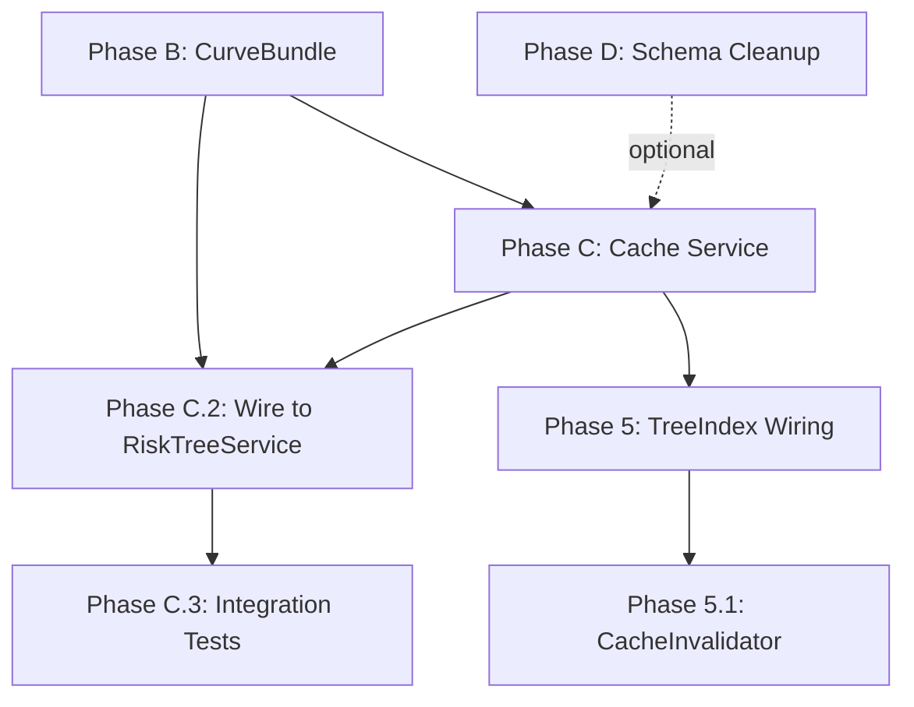

# CurveBundle Caching Implementation Plan

**ADR:** ADR-014-proposal  
**Status:** Implementation Ready  
**Created:** Based on ADR-014 decision (Option C: CurveBundle only)

## Executive Summary

This plan implements the CurveBundle-only caching strategy defined in ADR-014. The key insight is that **tick domain monotonicity** (parents contain all descendant ticks) means expanding navigation never requires recalculation—we use incremental monoidal operations instead of re-running simulations.

---

## Current State Analysis

| Component | Status | Notes |
|-----------|--------|-------|
| `LECCache` | ⚠️ Exists, caches `LECCurveResponse` | Currently caches UI DTOs, not domain values |
| `TreeIndex` | ⚠️ Wired as empty | `Application.scala` provides `TreeIndex.empty` |
| `CacheController` | ✅ Working | Admin endpoints for cache management |
| `RiskTreeService` | ⚠️ No caching | Does not use `LECCache` at all |
| `CacheInvalidator` | ❌ Not implemented | No Irmin watch integration |

---

## Implementation Phases

### Phase B: CurveBundle Data Structure

**Goal:** Create the domain model for tick-aligned curve bundles.

**Files to create:**
1. `modules/common/src/main/scala/com/risquanter/register/domain/bundle/CurveBundle.scala`
   - `CurveBundle` case class with `domain: TickDomain` and `values: Map[NodeId, Vector[Double]]`
   - `TickDomain` refined type (sorted, non-empty sequence of exceedance probabilities)
   - Monoidal `Identity[CurveBundle]` instance (join-semilattice on ticks, tick-aligned additive combination)

2. `modules/common/src/main/scala/com/risquanter/register/domain/bundle/TickDomain.scala`
   - `TickDomain` opaque type with Iron refinements
   - `expandTo` operation (union of two domains → tick-aligned interpolation)
   - Proof of monotonicity: parent domain ⊇ all child domains

**Tests:**
- `CurveBundleSpec.scala`: Verify monoidal laws, tick interpolation, domain expansion

---

### Phase C: CurveBundleCache Service

**Goal:** Replace current LECCurveResponse caching with CurveBundle caching.

**Approach:** Refactor `LECCache` to become `CurveBundleCache`:

**Files to modify:**
1. `modules/server/src/main/scala/com/risquanter/register/services/cache/CurveBundleCache.scala`
   - Rename from `LECCache.scala`
   - Cache `CurveBundle` instead of `LECCurveResponse`
   - Keep `TreeIndex` dependency for O(depth) invalidation
   - Add `getOrCompute(nodeId, simulation)` pattern

**Files to update:**
- `CacheController.scala`: Update to work with `CurveBundleCache`
- `Application.scala`: Wire `CurveBundleCache` instead of `LECCache`

**New file:**
2. `modules/server/src/main/scala/com/risquanter/register/services/bundle/CurveBundleBuilder.scala`
   - Convert raw simulation outcomes → `CurveBundle`
   - Implements tick domain creation from outcomes
   - Provides `expandTo(targetDomain)` for parent aggregation

---

### Phase C.2: Wire Cache to RiskTreeService

**Goal:** `RiskTreeService` uses `CurveBundleCache` for simulation results.

**Files to modify:**
1. `modules/server/src/main/scala/com/risquanter/register/services/RiskTreeServiceLive.scala`
   - Add `CurveBundleCache` dependency
   - Implement cache-aside pattern:
     ```
     getNodeLEC(nodeId) =
       CurveBundleCache.get(nodeId).flatMap:
         case Some(bundle) => ZIO.succeed(bundle)
         case None => simulate(node) >>= (bundle => cache.set(nodeId, bundle) *> ZIO.succeed(bundle))
     ```
   - Leaf: simulate → bundle
   - Aggregate: getChildren.map(_.bundles).combineAll using Identity[CurveBundle]

2. `modules/server/src/main/scala/com/risquanter/register/services/tree/RiskTreeWithLEC.scala`
   - Update to work with `CurveBundle` internally
   - Convert `CurveBundle` → `LECCurveResponse` at API boundary

**Tests:**
- `RiskTreeServiceCachingSpec.scala`: Verify cache hit/miss behavior
- `CurveBundleCacheSpec.scala`: Update existing `LECCacheSpec.scala`

---

### Phase C.3: Integration Tests for Caching

**Goal:** End-to-end tests verifying cache behavior.

**Files to create:**
1. `modules/server/src/test/scala/com/risquanter/register/integration/CachingIntegrationSpec.scala`
   - Test: Navigate to leaf → cached, navigate to parent → uses incremental combine
   - Test: Invalidate leaf → parent cache cleared, sibling cache preserved
   - Test: Expand tick domain → no recalculation, just interpolation
   - Test: Cache stats endpoint returns correct counts

**Test scenarios:**
```
Scenario: Cache Hit on Navigation Expansion
  Given: User has viewed leaf node "cyber"
  When: User navigates to parent "ops-risk"
  Then: cyber's CurveBundle is retrieved from cache (not re-simulated)
  And: ops-risk's CurveBundle is computed by combining cached children

Scenario: Invalidation Preserves Unaffected Subtrees
  Given: cache contains bundles for [portfolio, ops-risk, market-risk, cyber, hardware]
  When: user modifies "hardware" node
  Then: invalidated = [hardware, ops-risk, portfolio]
  And: [market-risk, cyber] remain cached

Scenario: Tick Domain Monotonicity
  Given: cyber has domain [0.1, 0.5, 0.9]
  And: hardware has domain [0.1, 0.3, 0.5, 0.9]
  When: computing ops-risk (parent of both)
  Then: ops-risk domain = [0.1, 0.3, 0.5, 0.9] (union)
  And: cyber's values are interpolated at 0.3 before combining
```

---

### Phase D: Schema.any Cleanup (Iron Types)

**Goal:** Replace `Schema.any` workarounds with proper Iron-based schemas.

**Files to modify:**
1. `modules/common/src/main/scala/com/risquanter/register/domain/tree/RiskTree.scala`
   - Replace `Schema.any[RiskTree]` with proper derived schema
   - Requires Tapir-Iron integration

2. `modules/common/src/main/scala/com/risquanter/register/domain/data/Provenance.scala`
   - Replace `Schema.any[TreeProvenance]` with proper derived schema

**Approach:** 
- Add `tapir-iron` dependency if not present
- Define `Schema[SafeId]` instances via Iron integration
- Derive schemas normally

**Note:** This is a cleanup task, not blocking for CurveBundle functionality.

---

### Phase 5: TreeIndex Wiring

**Goal:** `TreeIndex` provides real parent-pointer data instead of empty index.

**Files to modify:**
1. `modules/server/src/main/scala/com/risquanter/register/services/tree/TreeIndexService.scala`
   - Currently exists but not fully wired
   - Needs to build `TreeIndex` from `RiskTreeRepository` on startup/tree-load

2. `modules/server/src/main/scala/com/risquanter/register/Application.scala`
   - Replace `ZLayer.succeed(TreeIndex.empty)` with `TreeIndexService.layer`
   - Wire `TreeIndexService` → `RiskTreeRepository`

3. `modules/server/src/main/scala/com/risquanter/register/services/tree/TreeIndex.scala`
   - Verify `ancestorPath(nodeId)` returns correct path for invalidation

**Tests:**
- `TreeIndexServiceSpec.scala`: Verify index built from real tree data
- `TreeIndexInvalidationSpec.scala`: Verify O(depth) path lookup

---

### Phase 5.1: CacheInvalidator (Irmin Watch)

**Goal:** Automatic cache invalidation when Irmin data changes.

**Files to create:**
1. `modules/server/src/main/scala/com/risquanter/register/services/cache/CacheInvalidator.scala`
   - Watches Irmin GraphQL subscription for node changes
   - On change: call `CurveBundleCache.invalidate(nodeId)`
   - Integrate with SSEHub to notify UI of stale data

**Architecture:**
```
Irmin → GraphQL Subscription → CacheInvalidator → CurveBundleCache.invalidate
                                                 → SSEHub.publish(CacheInvalidated(nodeId))
                                                 → UI receives SSE, refreshes view
```

**Tests:**
- `CacheInvalidatorSpec.scala`: Mock Irmin subscription, verify invalidation
- Integration: Verify end-to-end SSE notification

---

## Decision Point: LECCache Rename Strategy

**Option 1: Rename `LECCache` → `CurveBundleCache`**
- Pro: Clean semantic break, matches ADR-014 terminology
- Con: More files to update

**Option 2: Keep `LECCache` name, change internals**
- Pro: Fewer changes
- Con: Name doesn't reflect new behavior

**Recommendation:** Option 1 (rename) for clarity. The name change signals the architectural shift.

---

## Dependencies



**Critical Path:** B → C → C.2 → C.3  
**Parallel:** Phase D (cleanup), Phase 5/5.1 (invalidation infrastructure)

---

## Test Coverage Requirements

| Phase | Unit Tests | Integration Tests |
|-------|------------|-------------------|
| B | `CurveBundleSpec`, `TickDomainSpec` | - |
| C | `CurveBundleCacheSpec` | - |
| C.2 | `RiskTreeServiceCachingSpec` | - |
| C.3 | - | `CachingIntegrationSpec` |
| 5 | `TreeIndexServiceSpec` | `TreeIndexInvalidationSpec` |
| 5.1 | `CacheInvalidatorSpec` | Full E2E with mock Irmin |

---

## Success Criteria

1. **Cache hit rate > 80%** for typical navigation patterns (leaf → parent expansion)
2. **No simulation on navigation expansion** (incremental monoidal combine only)
3. **O(depth) invalidation** verified by integration tests
4. **All 183+ existing tests pass** after each phase
5. **New integration tests cover** cache hit/miss/invalidation scenarios

---

## Open Questions for User

1. **Irmin subscription format:** What's the GraphQL subscription schema for node changes?
2. **Multi-tree support:** Should `TreeIndex` be per-tree or global with tree prefixes?
3. **Cache size limits:** Any memory constraints requiring LRU eviction?

---

## Estimated Effort

| Phase | Effort | Risk |
|-------|--------|------|
| B: CurveBundle | 4-6 hours | Medium (domain modeling) |
| C: Cache Service | 2-3 hours | Low (refactor existing) |
| C.2: Wire to RiskTreeService | 3-4 hours | Medium (service changes) |
| C.3: Integration Tests | 3-4 hours | Low |
| D: Schema Cleanup | 2-3 hours | Low (optional) |
| 5: TreeIndex Wiring | 2-3 hours | Low |
| 5.1: CacheInvalidator | 4-6 hours | High (Irmin integration) |

**Total:** ~20-29 hours

---

## Next Action

**Ready to proceed with Phase B: CurveBundle Data Structure?**

This establishes the foundation for all subsequent phases.
